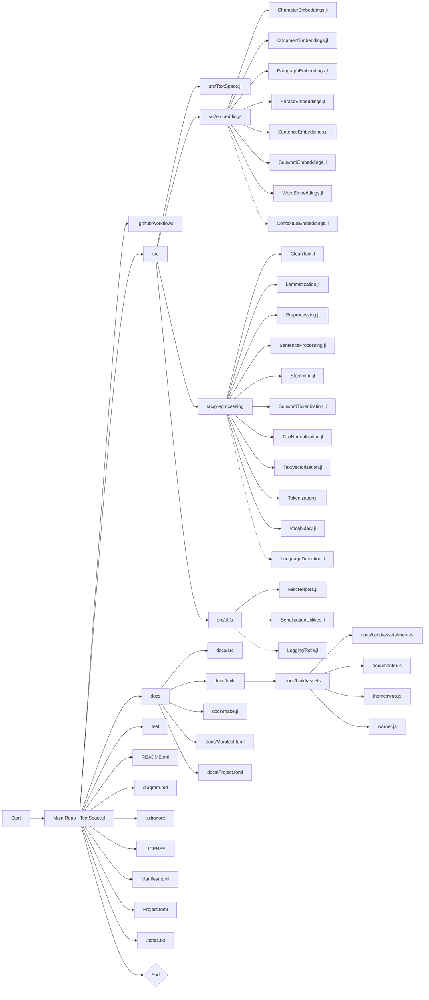

```mermaid
flowchart LR
    A[Start] --> B[Main Repo - TextSpace.jl]

    B --> C[.github/workflows]
    B --> E[src]
    E --> E1[src/TextSpace.jl]
    E --> E2[src/embeddings]
    E2 --> E2a[CharacterEmbeddings.jl]
    E2 --> E2b[DocumentEmbeddings.jl]
    E2 --> E2c[ParagraphEmbeddings.jl]
    E2 --> E2d[PhraseEmbeddings.jl]
    E2 --> E2e[SentenceEmbeddings.jl]
    E2 --> E2f[SubwordEmbeddings.jl]
    E2 --> E2g[WordEmbeddings.jl]
    E2 -.-> E2h[ContextualEmbeddings.jl]

    E --> E3[src/preprocessing]
    E3 --> E3a[CleanText.jl]
    E3 --> E3b[Lemmatization.jl]
    E3 --> E3c[Preprocessing.jl]
    E3 --> E3d[SentenceProcessing.jl]
    E3 --> E3e[Stemming.jl]
    E3 --> E3f[SubwordTokenization.jl]
    E3 --> E3g[TextNormalization.jl]
    E3 --> E3h[TextVectorization.jl]
    E3 --> E3i[Tokenization.jl]
    E3 --> E3j[Vocabulary.jl]
    E3 -.-> E3k[LanguageDetection.jl]

    E --> E4[src/utils]
    E4 --> E4a[MiscHelpers.jl]
    E4 --> E4b[SerializationUtilities.jl]
    E4 -.-> E4c[LoggingTools.jl]

    B --> D[docs]
    D --> D1[docs/src]
    D --> D2[docs/build]
    D2 --> D2a[docs/build/assets]
    D2a --> D2a1[docs/build/assets/themes]
    D2a --> D2a2[documenter.js]
    D2a --> D2a3[themeswap.js]
    D2a --> D2a4[warner.js]
    D --> D3[docs/make.jl]
    D --> D4[docs/Manifest.toml]
    D --> D5[docs/Project.toml]

    B --> F[test]
    B --> G[README.md]
    B --> H[diagram.md]
    B --> I[.gitignore]
    B --> J[LICENSE]
    B --> K[Manifest.toml]
    B --> L[Project.toml]
    B --> M[.notes.txt]

    B --> N{End}
```
