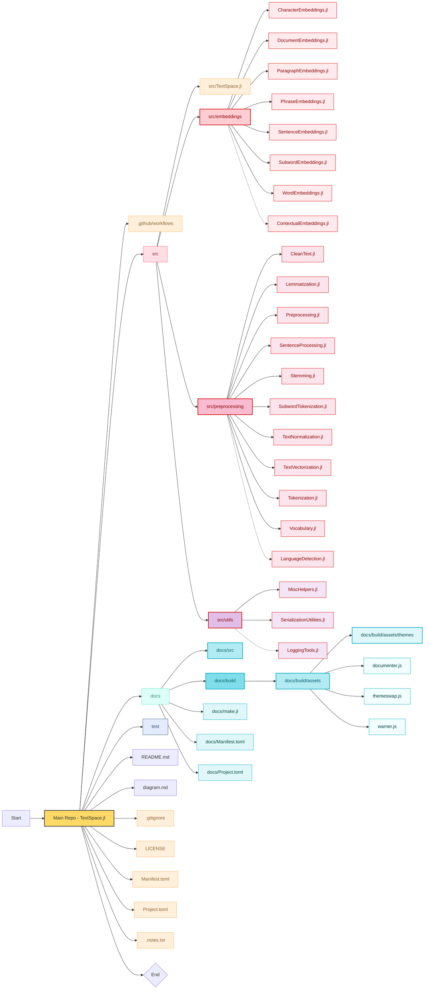

```mermaid
flowchart LR
    A["Start"] --> B["Main Repo - TextSpace.jl"]
    B --> C[".github/workflows"] & E["src"] & D["docs"] & F["test"] & G["README.md"] & H["diagram.md"] & I[".gitignore"] & J["LICENSE"] & K["Manifest.toml"] & L["Project.toml"] & M[".notes.txt"] & N{"End"}
    E --> E1["src/TextSpace.jl"] & E2["src/embeddings"] & E3["src/preprocessing"] & E4["src/utils"]
    E2 --> E2a["CharacterEmbeddings.jl"] & E2b["DocumentEmbeddings.jl"] & E2c["ParagraphEmbeddings.jl"] & E2d["PhraseEmbeddings.jl"] & E2e["SentenceEmbeddings.jl"] & E2f["SubwordEmbeddings.jl"] & E2g["WordEmbeddings.jl"]
    E2 -.-> E2h["ContextualEmbeddings.jl"]
    E3 --> E3a["CleanText.jl"] & E3b["Lemmatization.jl"] & E3c["Preprocessing.jl"] & E3d["SentenceProcessing.jl"] & E3e["Stemming.jl"] & E3f["SubwordTokenization.jl"] & E3g["TextNormalization.jl"] & E3h["TextVectorization.jl"] & E3i["Tokenization.jl"] & E3j["Vocabulary.jl"]
    E3 -.-> E3k["LanguageDetection.jl"]
    E4 --> E4a["MiscHelpers.jl"] & E4b["SerializationUtilities.jl"]
    E4 -.-> E4c["LoggingTools.jl"]
    D --> D1["docs/src"] & D2["docs/build"] & D3["docs/make.jl"] & D4["docs/Manifest.toml"] & D5["docs/Project.toml"]
    D2 --> D2a["docs/build/assets"]
    D2a --> D2a1["docs/build/assets/themes"] & D2a2["documenter.js"] & D2a3["themeswap.js"] & D2a4["warner.js"]
     B:::mainrepo
     C:::Peach
     E:::Rose
     D:::Aqua
     F:::Sky
     I:::Peach
     J:::Peach
     K:::Peach
     L:::Peach
     M:::Peach
     E1:::Peach
     E2:::red01
     E3:::red02
     E4:::red03
     E2a:::red01file
     E2b:::red01file
     E2c:::red01file
     E2d:::red01file
     E2e:::red01file
     E2f:::red01file
     E2g:::red01file
     E2h:::red01file
     E3a:::red02file
     E3b:::red02file
     E3c:::red02file
     E3d:::red02file
     E3e:::red02file
     E3f:::red02file
     E3g:::red02file
     E3h:::red02file
     E3i:::red02file
     E3j:::red02file
     E3k:::red02file
     E4a:::red03file
     E4b:::red03file
     E4c:::red03file
     D1:::Aqua
     D1:::cyan01
     D2:::Aqua
     D2:::cyan02
     D3:::Aqua
     D3:::cyan02file
     D4:::Aqua
     D4:::cyan02file
     D5:::Aqua
     D5:::cyan02file
     D2a:::cyan02-02
     D2a1:::cyan02-04
     D2a2:::cyan02-06
     D2a3:::cyan02-06
     D2a4:::cyan02-06
    classDef mainrepo fill:#ffd966,stroke:#333,stroke-width:2px
    classDef Aqua stroke-width:1px, stroke-dasharray:none, stroke:#46EDC8, fill:#DEFFF8, color:#378E7A
    classDef red01 fill:#FFCDD2,stroke:#D50000,stroke-width:2px,color:#8B0000
    classDef red01file fill:#FFEBEE,stroke:#D50000,stroke-width:1px,color:#8B0000
    classDef red02 fill:#F8BBD0,stroke:#D50000,stroke-width:2px,color:#8B0000
    classDef red02file fill:#FCE4EC,stroke:#D50000,stroke-width:1px,color:#8B0000
    classDef red03 fill:#E1BEE7,stroke:#D50000,stroke-width:2px,color:#8B0000
    classDef red03file fill:#F3E5F5,stroke:#D50000,stroke-width:1px,color:#8B0000
    classDef Rose stroke-width:1px, stroke-dasharray:none, stroke:#FF5978, fill:#FFDFE5, color:#8E2236
    classDef cyan01 fill:#B2EBF2,stroke:#00ACC1,stroke-width:2px,color:#006064
    classDef cyan01file fill:#E0F7FA,stroke:#00ACC1,stroke-width:1px,color:#004D40
    classDef cyan02 fill:#80DEEA,stroke:#00ACC1,stroke-width:2px,color:#006064
    classDef cyan02file fill:#E0F7FA,stroke:#00ACC1,stroke-width:1px,color:#004D40
    classDef cyan02-02 fill:#B2EBF2,stroke:#00ACC1,stroke-width:2px,color:#005A68
    classDef cyan02-04 fill:#E0F7FA,stroke:#00ACC1,stroke-width:2px,color:#004D52
    classDef cyan02-06 fill:#F1FDFF,stroke:#00ACC1,stroke-width:1px,color:#004044
    classDef Peach stroke-width:1px, stroke-dasharray:none, stroke:#FBB35A, fill:#FFEFDB, color:#8F632D
    classDef Sky stroke-width:1px, stroke-dasharray:none, stroke:#374D7C, fill:#E2EBFF, color:#374D7C
```
