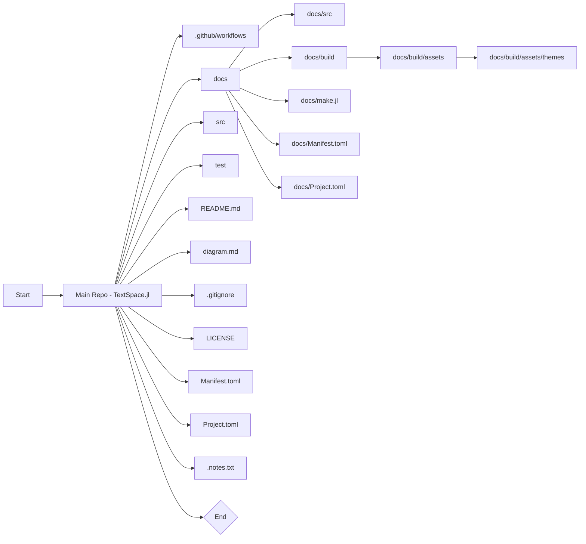

```mermaid
flowchart LR
    A[Start] --> B[Main Repo - TextSpace.jl]

    B --> C[.github/workflows]
    B --> D[docs]
    B --> E[src]
    B --> F[test]
    B --> G[README.md]
    B --> H[diagram.md]

    D --> D1[docs/src]
    D --> D2[docs/build]
    D2 --> D2a[docs/build/assets]
    D2a --> D2a1[docs/build/assets/themes]
    D --> D3[docs/make.jl]
    D --> D4[docs/Manifest.toml]
    D --> D5[docs/Project.toml]

    B --> I[.gitignore]
    B --> J[LICENSE]
    B --> K[Manifest.toml]
    B --> L[Project.toml]
    B --> M[.notes.txt]

    B --> N{End}
```
